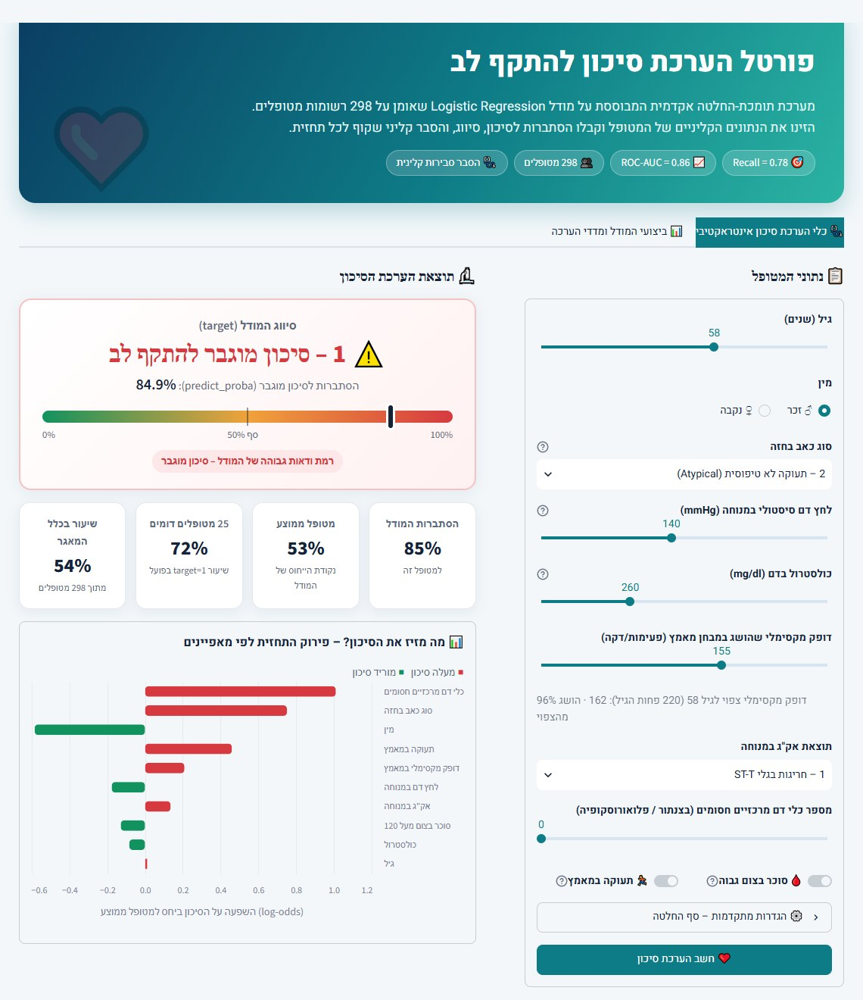
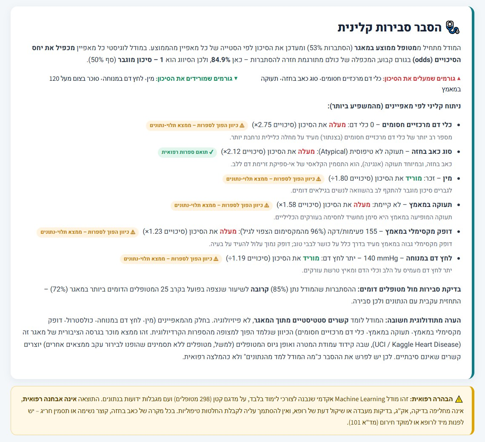
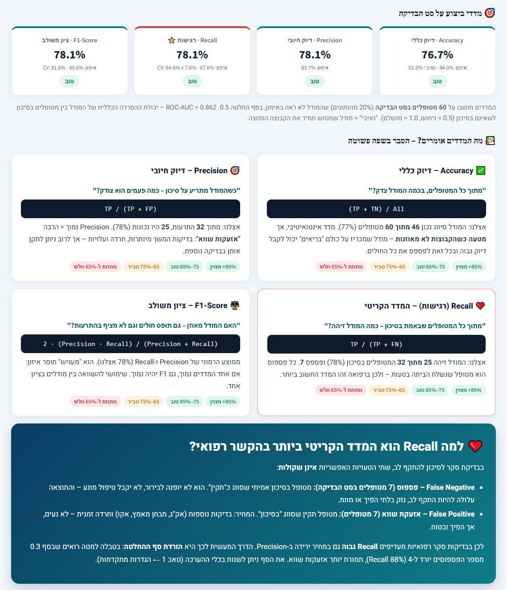
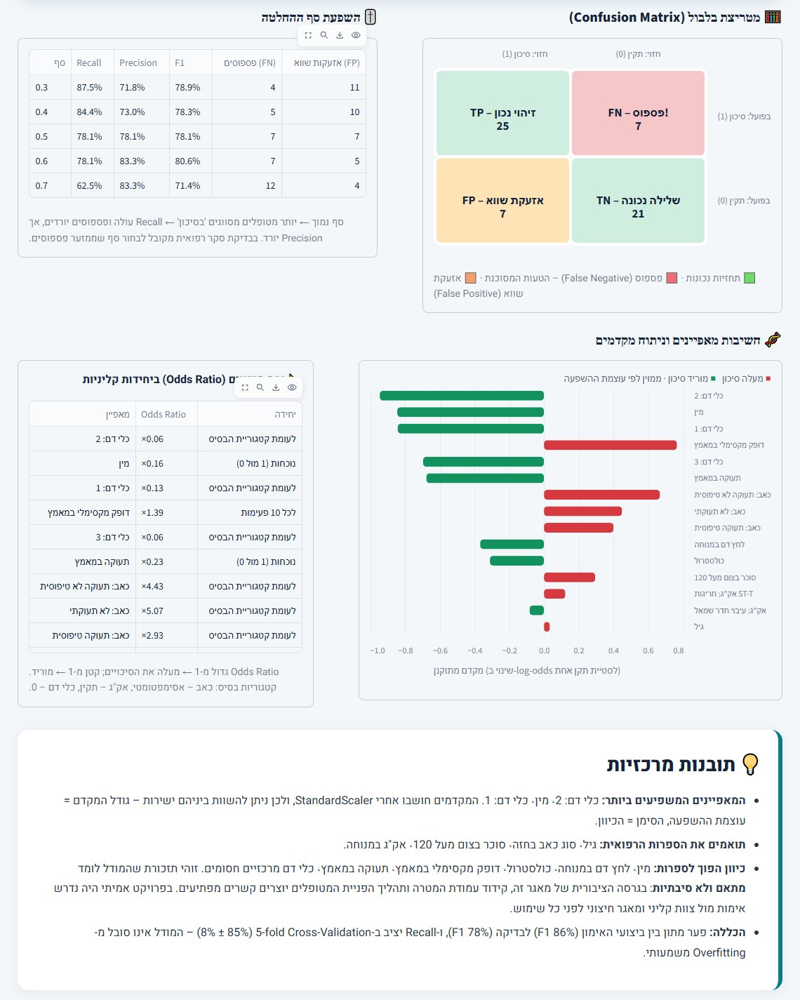
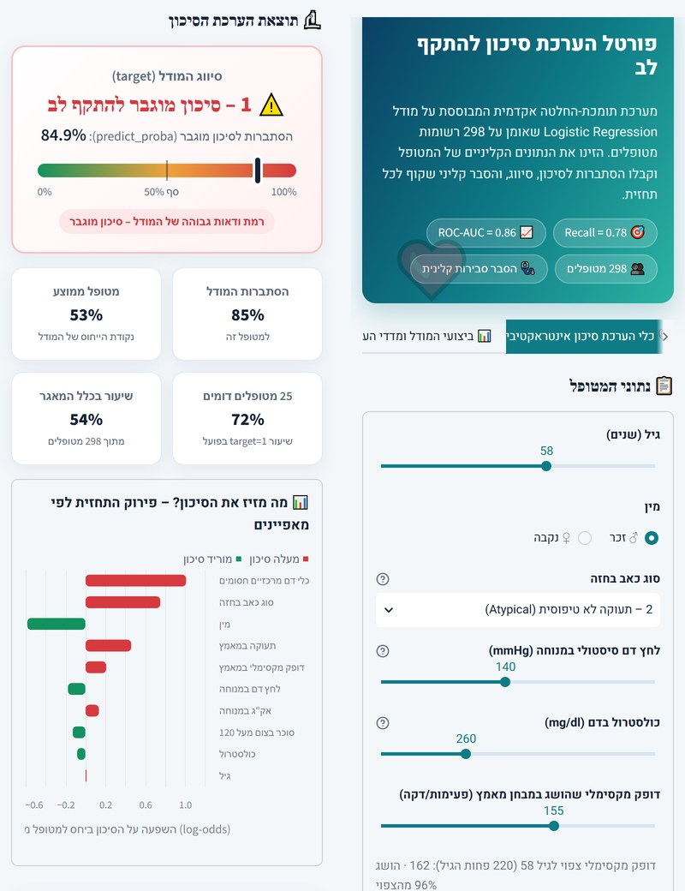

<div dir="rtl">

# ❤️ חיזוי סיכון להתקף לב – Heart Attack Risk Prediction

<!-- Live Demo: replace the placeholder URL below after deploying to Streamlit Community Cloud -->
[](https://YOUR-APP-NAME.streamlit.app/)


> **חלק ב' של מטלת Machine Learning** – בניית מודל **Logistic Regression** לחיזוי הסיכון להתקף לב, הערכתו במדדי **Accuracy, Precision, Recall, F1**, ופריסתו כפורטל הערכת סיכון רפואי אינטראקטיבי ב-**Streamlit**, בעברית מלאה ובממשק RTL.

> 🔗 **Live Demo:** *(יעודכן לאחר הפריסה ל-Streamlit Community Cloud)* – `https://YOUR-APP-NAME.streamlit.app`

> ⚠️ **הבהרה רפואית:** זהו פרויקט אקדמי לצורכי לימוד בלבד. התוצאות **אינן אבחנה רפואית** ואינן מחליפות בדיקה או שיקול דעת של רופא.

---

## 📌 תקציר מנהלים

| נושא | פירוט |
|---|---|
| **מטרה** | זיהוי מוקדם של מטופלים בסיכון מוגבר להתקף לב, עם הסבר קליני שקוף לכל תחזית |
| **נתונים** | 298 מטופלים, 10 מאפיינים קליניים + עמודת מטרה (`target`: 0 = סיכון נמוך, 1 = סיכון מוגבר). 0 ערכים חסרים, 0 כפילויות |
| **מודל** | `LogisticRegression` בתוך `Pipeline` עם `StandardScaler`, אחרי One-Hot Encoding ל-`cp`, `restecg`, `ca` |
| **ביצועים (סט בדיקה)** | **Accuracy 76.7%** · **Precision 78.1%** · **Recall 78.1%** · **F1 78.1%** · ROC-AUC 0.862 |
| **יציבות** | 5-fold Cross-Validation: **Recall 84.5% ± 7.6%**, F1 81.6% ± 3.7% |
| **המדד החשוב ביותר** | **Recall** – כל פספוס (False Negative) הוא מטופל בסיכון שנשלח הביתה ללא טיפול |
| **תוצר** | אפליקציית Streamlit בעברית: כלי הערכת סיכון + "הסבר סבירות קלינית" + לוח ביצועי מודל ומדדים |

---

## 🖥️ ממשק האפליקציה

<p align="center">
  
</p>
<p align="center"><b>איור 1 – כלי הערכת הסיכון האינטראקטיבי.</b> הצוות הרפואי מזין את נתוני המטופל (מימין) ומקבל מיד סיווג (0 / 1), הסתברות מ-<code>predict_proba</code> על גבי מד סיכון צבעוני, השוואה למטופל הממוצע ול-25 המטופלים הדומים ביותר במאגר, ותרשים שמפרק את התחזית לתרומת כל מאפיין.</p>

<p align="center">
  
</p>
<p align="center"><b>איור 2 – הסבר סבירות קלינית.</b> לכל תחזית נוצר הסבר דינמי: הגורמים שמעלים ומורידים את הסיכון, מכפיל יחס הסיכויים (odds) של כל מאפיין, השוואה לידע הקרדיולוגי (✔ תואם ספרות / ⚠ ממצא תלוי-נתונים), בדיקת סבירות מול מטופלים דומים, והבהרה רפואית בולטת.</p>

<p align="center">
  
</p>
<p align="center"><b>איור 3 – ביצועי המודל ומדדי הערכה.</b> כרטיסי Accuracy, Precision, Recall ו-F1 עם דירוג איכות, הסבר בשפה פשוטה לכל מדד ("מה הוא שואל?", נוסחה, ומה נחשב טוב או חלש), ומסגרת ייעודית שמסבירה למה Recall הוא המדד הקריטי ברפואה.</p>

<p align="center">
  
</p>
<p align="center"><b>איור 4 – מטריצת בלבול, סף החלטה וחשיבות מאפיינים.</b> מטריצת הבלבול מסמנת את הפספוסים (FN) באדום, טבלת הספים מראה את המחיר של כל סף במונחי פספוסים מול אזעקות שווא, ומקדמי המודל המתוקננים מוצגים לצד Odds Ratio ביחידות קליניות.</p>

<p align="center">
  
</p>
<p align="center"><b>איור 5 – תצוגה רספונסיבית במובייל.</b> הכרטיסים, הטפסים והתרשימים מסתדרים בעמודה אחת במסכים צרים, תוך שמירה מלאה על RTL.</p>

עיצוב בהשראת דשבורדים רפואיים מקצועיים: כרטיסים נקיים, צללים רכים, פלטת צבעים רפואית (טורקיז / ירוק / אדום לסיכון), גופן Heebo, **RTL מלא** ותצוגה **רספונסיבית** למובייל, טאבלט ומחשב.

---

## 📏 מדדי הערכה – הסבר מעמיק וחשיבותם הרפואית

כל המדדים מחושבים על **סט הבדיקה בלבד** – 60 מטופלים (20%) שהמודל לא ראה באימון – בסף החלטה 0.5.

### מטריצת הבלבול (Confusion Matrix)

|  | **חזוי: סיכון (1)** | **חזוי: תקין (0)** |
|---|:---:|:---:|
| **בפועל: סיכון (1)** | ✅ TP = **25** (זיהוי נכון) | ❌ FN = **7** (פספוס – הטעות המסוכנת) |
| **בפועל: תקין (0)** | ⚠️ FP = **7** (אזעקת שווא) | ✅ TN = **21** (שלילה נכונה) |

### תמונת מצב

| מדד | שאלה שהמדד עונה עליה | נוסחה | אימון | **בדיקה** | מודל נאיבי* |
|---|---|---|:---:|:---:|:---:|
| **Accuracy** | בכמה מכלל המטופלים המודל צדק? | (TP+TN) / All | 84.0% | **76.7%** | 53.3% |
| **Precision** | כשהמודל מתריע – כמה פעמים הוא צודק? | TP / (TP+FP) | 83.7% | **78.1%** | 53.3% |
| **Recall** ⭐ | מכל המטופלים בסיכון – כמה זוהו? | TP / (TP+FN) | 87.6% | **78.1%** | 100%** |
| **F1-Score** | האם יש איזון בין Precision ל-Recall? | 2·P·R / (P+R) | 85.6% | **78.1%** | 69.6% |
| **ROC-AUC** | עד כמה המודל מפריד בין הקבוצות (ללא תלות בסף)? | – | 0.929 | **0.862** | 0.5 |

\* מודל נאיבי = מנחש תמיד את הקבוצה הנפוצה ("סיכון").  ** Recall של 100% "בחינם" – אבל כל מטופל מקבל התרעה, ולכן המודל חסר ערך (Precision ו-Accuracy של 53%). זו בדיוק הסיבה שלא בוחנים מדד אחד לבד.

### מה נחשב "טוב"?

| טווח | פרשנות |
|---|---|
| 85% ומעלה | 🟢 מצוין |
| 75%–85% | 🟢 טוב – כאן נמצא המודל שלנו בכל ארבעת המדדים |
| 65%–75% | 🟠 סביר |
| מתחת ל-65% | 🔴 חלש |

הערה: ברפואה הרף תלוי בהקשר. בבדיקת סקר מצפים ל-Recall גבוה מאוד, ובכלי אבחנה סופי גם ל-Precision גבוה.

### ❤️ למה Recall הוא המדד הקריטי בהקשר הרפואי?

שתי הטעויות האפשריות **אינן שקולות**:

- **False Negative (פספוס):** מטופל בסיכון אמיתי שסווג "תקין". הוא לא יופנה לבירור ולא יקבל טיפול מונע. **התוצאה עלולה להיות התקף לב, נזק בלתי הפיך או מוות.**
- **False Positive (אזעקת שווא):** מטופל תקין שסווג "בסיכון". המחיר הוא בדיקות נוספות (אק"ג, מבחן מאמץ, אקו) וחרדה זמנית. **לא נעים, אך הפיך ובטוח.**

לכן בבדיקות סקר רפואיות **ממקסמים את Recall** גם במחיר ירידה ב-Precision. הכלי המעשי לכך הוא **הורדת סף ההחלטה**:

| סף | Recall | Precision | F1 | פספוסים (FN) | אזעקות שווא (FP) |
|:---:|:---:|:---:|:---:|:---:|:---:|
| 0.3 | **87.5%** | 71.8% | 78.9% | **4** | 11 |
| 0.4 | 84.4% | 73.0% | 78.3% | 5 | 10 |
| 0.5 (ברירת מחדל) | 78.1% | 78.1% | 78.1% | 7 | 7 |
| 0.6 | 78.1% | 83.3% | 80.6% | 7 | 5 |
| 0.7 | 62.5% | 83.3% | 71.4% | 12 | 4 |

**המלצה:** לשימוש כבדיקת סקר, סף של 0.3–0.4 מוריד את מספר הפספוסים מ-7 ל-4–5, תמורת 3–4 אזעקות שווא נוספות. בהקשר רפואי זה מחיר סביר. הסף ניתן לשינוי באפליקציה (טאב 1 ← הגדרות מתקדמות).

---

## 🧬 פרשנות המודל – מה המודל למד?

המקדמים חושבו אחרי `StandardScaler`, ולכן ניתן להשוות ביניהם ישירות. **Odds Ratio** (= e<sup>מקדם</sup>) גדול מ-1 מעלה את הסיכויים, וקטן מ-1 מוריד אותם.

| מאפיין | Odds Ratio | יחידה | כיוון ביחס לספרות הרפואית |
|---|:---:|---|:---:|
| סוג כאב בחזה (לעומת אסימפטומטי) | ×2.9 – ×5.1 | נוכחות התסמין | ✔ תואם |
| סוכר בצום > 120 | ×2.24 | נוכחות | ✔ תואם |
| אק"ג: חריגות ST-T | ×1.28 | לעומת תקין | ✔ תואם |
| גיל | ×1.04 | לכל 10 שנים | ✔ תואם (השפעה חלשה) |
| דופק מקסימלי במאמץ | ×1.39 | לכל 10 פעימות | ⚠ הפוך |
| מין (זכר) | ×0.16 | זכר מול נקבה | ⚠ הפוך |
| תעוקה במאמץ | ×0.23 | נוכחות | ⚠ הפוך |
| כלי דם חסומים (1–3) | ×0.06 – ×0.13 | לעומת 0 | ⚠ הפוך |
| לחץ דם / כולסטרול | ×0.81 / ×0.75 | לכל 10 mmHg / 50 mg/dl | ⚠ הפוך (חלש) |

**שקיפות מתודולוגית:** בחלק מהמאפיינים הכיוון שנלמד הפוך לידע הקרדיולוגי. זהו ממצא מוכר בגרסה הציבורית של מאגר זה (UCI / Kaggle Heart Disease): קידוד עמודת המטרה ותהליך הפניית המטופלים (למשל, מטופלים ללא תסמינים שנשלחו לבירור בגלל ממצאים אחרים) יוצרים **מתאמים שאינם סיבתיים**. המודל משקף את הנתונים, לא את הפיזיולוגיה. לכן האפליקציה מסמנת כל גורם כ"✔ תואם ספרות רפואית" או "⚠ ממצא תלוי-נתונים", ובפרויקט אמיתי היה נדרש אימות מול צוות קליני ומאגר חיצוני.

### 🩺 פרדיקציה למטופל חדש (דרישת המטלה)

מטופל בדוי עם נתונים ריאליסטיים: **גבר בן 58**, תעוקה לא טיפוסית (`cp=2`), לחץ דם 140 mmHg, כולסטרול 260 mg/dl, סוכר תקין, חריגות ST-T באק"ג, דופק מקסימלי 155, ללא תעוקה במאמץ, 0 כלי דם חסומים.

- **תחזית:** `target = 1` – סיכון מוגבר, **הסתברות 84.9%** (מטופל ממוצע: 53.1%).
- **פרשנות קלינית:** הגורמים המרכזיים שמעלים את הסיכון הם נוכחות כאב בחזה מסוג תעוקה (תסמין קלאסי של אי-ספיקת זרימת דם ללב), חריגות ST-T באק"ג, ושאר המאפיינים כפי שנלמדו מהמאגר. לחץ הדם הגבולי-גבוה והכולסטרול הגבוה הם גורמי סיכון קלאסיים, אף שבמאגר זה השפעתם חלשה.
- **בדיקת סבירות:** בקרב 25 המטופלים הדומים ביותר במאגר, 72% סווגו בפועל כ-`target = 1`, כך שהתחזית עקבית עם הנתונים.
- **משמעות מעשית:** מטופל כזה היה מופנה להמשך בירור קרדיולוגי (מבחן מאמץ, אקו לב ובדיקות דם). המודל הוא כלי תומך-החלטה ולא אבחנה.

---

## ⚙️ צינור עיבוד הנתונים (Data Pipeline)

```text
Project Heart attack data.csv
        │
        ▼
1. טעינה ובדיקה        298 שורות × 11 עמודות · 0 ערכים חסרים · 0 כפילויות · בדיקת תקינות קודים
        │               (ערכים חסרים, אם יופיעו: חציון למספרי, שכיח לקטגוריאלי)
        ▼
2. One-Hot Encoding    cp → cp_1, cp_2, cp_3 · restecg → restecg_1, restecg_2 · ca → ca_1, ca_2, ca_3
        │               (drop_first: קטגוריה 0 = בסיס) · sex, fbs, exng נשארים בינאריים · סה"כ 15 מאפיינים
        ▼
3. Train/Test Split    80/20 מרובד (stratified) · random_state=42 · 238 אימון / 60 בדיקה
        │
        ▼
4. StandardScaler      ממוצע 0, סטיית תקן 1 (fit על סט האימון בלבד – ללא דליפת מידע)
        │
        ▼
5. LogisticRegression  רגולריזציית L2 · max_iter=1000
        │
        ▼
6. הערכה               Accuracy · Precision · Recall · F1 · ROC-AUC · Confusion Matrix · 5-fold CV · ניתוח ספים
```

**למה One-Hot ולא קידוד מספרי?** `cp` (סוג כאב), `restecg` ו-`ca` הם משתנים קטגוריאליים. קידוד 0–3 כמספר היה מניח שהמרחק בין "אסימפטומטי" ל"תעוקה טיפוסית" שווה למרחק בין "תעוקה לא טיפוסית" ל"כאב לא תעוקתי". One-Hot מאפשר למודל ללמוד השפעה נפרדת לכל קטגוריה.

**למה StandardScaler?** הוא מאפשר לרגולריזציה לפעול באופן הוגן על כל המאפיינים, ומאפשר להשוות ישירות את גודל המקדמים כמדד חשיבות.

---

## 📂 מבנה הפרויקט

```text
heart-attack-prediction/
├── app.py                  # אפליקציית Streamlit (עברית, RTL, רספונסיבית)
├── train.py                # אימון והערכה משורת הפקודה + שמירת דוחות
├── src/
│   └── heart_model.py      # טעינה, קידוד, Pipeline, מדדים, הסבר תחזית
├── data/
│   └── heart_data.csv      # מאגר הנתונים
├── reports/
│   ├── metrics.json        # כל המדדים (אימון, בדיקה, CV, ספים)
│   └── coefficients.csv    # מקדמים ו-Odds Ratios
├── assets/                 # צילומי מסך ל-README
├── .streamlit/config.toml  # ערכת נושא
└── requirements.txt
```

---

## 🚀 התקנה והרצה

**דרישות:** Python 3.10 ומעלה.

```bash
# 1. שכפול המאגר
git clone https://github.com/itaybs/heart-attack-prediction.git
cd heart-attack-prediction

# 2. סביבה וירטואלית (מומלץ)
python -m venv .venv
# Windows:
.venv\Scripts\activate
# macOS / Linux:
source .venv/bin/activate

# 3. התקנת תלויות
pip install -r requirements.txt

# 4. אימון והערכה בשורת הפקודה (אופציונלי – מדפיס מדדים ושומר דוחות ל-reports/)
python train.py
# או עם תיקיית נתונים מקומית שמכילה 'Project Heart attack data.csv':
python train.py --data "path/to/folder"

# 5. הרצת האפליקציה
streamlit run app.py
```

האפליקציה תיפתח בכתובת `http://localhost:8501`.

**פריסה ל-Streamlit Community Cloud:** חברו את המאגר ב-[share.streamlit.io](https://share.streamlit.io), בחרו `app.py` כקובץ הראשי, ועדכנו את קישור ה-Live Demo בראש הקובץ.

---

## 🛠️ טכנולוגיות

`Python` · `pandas` · `NumPy` · `scikit-learn` (LogisticRegression, StandardScaler, Pipeline, StratifiedKFold) · `Streamlit` · `Altair`

**פרטי ממשק:** ה-CSS מוזרק כך שכל הממשק מיושר לימין (RTL), חוץ מהסליידרים ומהתרשימים שנשארים LTR (מינימום משמאל, מקסימום מימין). בנוסף, סקריפט קטן מקבע את ה-locale של רכיב הסליידר ל-`en-US`, כדי שבדפדפנים בעברית ידית הסליידר לא תוצג במיקום הפוך.

---

## ⚠️ הבהרה רפואית

פרויקט זה נבנה **לצורכי לימוד אקדמי בלבד**, על מדגם קטן (298 מטופלים) עם מגבלות ידועות בנתונים. התוצאות **אינן אבחנה רפואית**, ואינן מחליפות בדיקה, אק"ג, בדיקות מעבדה או שיקול דעת של רופא. בכל מקרה של כאב בחזה, קוצר נשימה או תסמין חריג, יש לפנות מיד לרופא או למוקד חירום.

---

<p align="center">© כל הזכויות שמורות לאיתי בסטקר</p>

</div>
